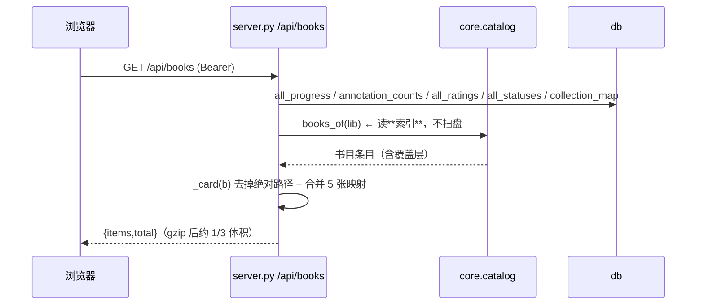
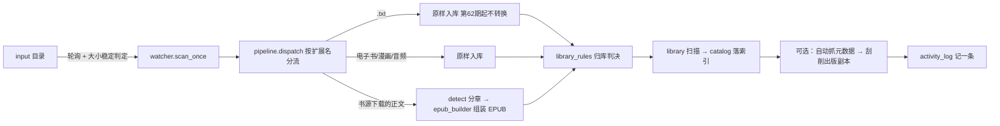
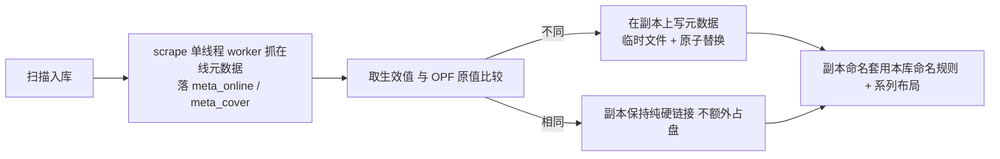

# 架构与数据流（architecture）

> 读法建议：先看 §1 分层与 §2 请求生命周期，再按你关心的链路跳读（书目 / 入库 / 出版 / 元数据 / 阅读 / 多端）。
> 硬约束与陷阱见 `AGENTS.md`；视觉见 `DESIGN.md`。

## 1. 分层

```
┌────────────────────────── 前端（frontend/src） ──────────────────────────┐
│ views/（页面）  components/（外壳·UI·阅读器·图表·工具）  stores/（Pinia）  │
│ lib/（偏好·单一判据·图表入口）  data/（nav / settingsNav / whatsNew）     │
└───────────────┬──────────────────────────────────────────────────────────┘
                │  fetch（同源 /api、/opds、/komga 等；Bearer token）
┌───────────────▼──────────────────────────────────────────────────────────┐
│ novelforge/server.py —— FastAPI：全部路由 + 中间件（gzip）+ 鉴权依赖       │
│   · 只做**编排与形状**：参数校验 → 调 core → 组装响应（如 _card 收口 path）│
└───────────────┬──────────────────────────────────────────────────────────┘
┌───────────────▼──────────────────────────────────────────────────────────┐
│ novelforge/core/* —— 领域逻辑（50+ 个模块，纯 Python，不依赖 FastAPI）     │
│  library · catalog · db · sqlcompat · pg · cache · fileops · publish ·    │
│  scrape · metadata · metasources · metafetch · metastore · series_meta ·  │
│  authors · narrators · stats · achievements · activity · recommend ·      │
│  embed · epub_cfi · comics · audio · audio_meta · detect · preprocess ·   │
│  pipeline · watcher · txtcache · units · migrate · bookdock · features ·  │
│  lib_settings · library_rules · opds · komga · komga_api · koreader ·     │
│  koreader_anno · integrations · auth · fonts · customfields · metascore · │
│  browse_counts · activity_log · ai_detect · network · migrate · pdfrender │
└───────────────┬──────────────────────────────────────────────────────────┘
                │
   ┌────────────▼───────────┐   ┌──────────────┐   ┌───────────────────────┐
   │ DB（SQLite | PostgreSQL│   │ Redis（可选） │   │ 磁盘：源书 / 副本 /   │
   │ 经 db._connect() 代理）│   │ 读缓存        │   │ 回收站 / 派生缓存     │
   └────────────────────────┘   └──────────────┘   └───────────────────────┘
```

**边界规则**：`core` 一律 `from .. import config`（裸 `import config` 会被同名命名空间包劫持）；`core` 不认识 HTTP。
前端**不直接碰磁盘**（本地导入走接口）。

## 2. 一次请求的生命周期（以「打开书架」为例）


- **关键点**：请求路径**不扫盘**。扫盘发生在 `catalog.refresh_library`（后台/显式扫描），把结果落 `book_index`。
  这是「书架 42 秒 → 毫秒级」的全部原因，**与选哪个数据库无关**。
- 前端**同一份数据只拉一次**：各 store 的 loader 用「在飞 Promise」做单飞闸（并发调用共享同一次请求）。

## 3. 书目索引（`core/catalog.py`）= 性能地基

- 增量刷新：按 `(size, mtime)` 判定变动（**每文件 1 次 stat**，不再 3 次）。
- 失效判据比「序号」不比「时刻」——同一刻度内判不出脏（历史坑）。
- `library._scan_once` 是「正确结果」的定义（无索引兜底 + 对拍脚本基准）；`catalog` 是常规路径。
- 读端 `catalog.books_of(lib)`；写端只在扫描/变更后刷新。`library.invalidate()` 是**统一的失效入口**。
- **扫描口径版本**（`library.SCAN_RULE_VERSION`）：凡能改变「条目边界或卡片字段口径」的改动都要 +1。
  `catalog` 把它**按库**记在 `app_state`（`book_index_rule:{lid}`），不一致 ⇒ 该库下一轮刷新**当作 force**
  全量重探一次，之后回落增量。这是**存量索引唯一的自愈通道** —— 磁盘上一个字节都没变，
  `(size, mtime)` 闸门永远不会重探那些旧行，改完口径用户看到的还是老样子，而且不报错、不重建。

## 4. 数据层

### 4.1 连接与并发
- 一切都走 `db._connect()`：返回持 `_lock`（**RLock**）的代理连接 `db._Conn`。
  **不要抓裸连接、不要绕开锁** —— 无锁并发访问会产生 `sqlite3.InterfaceError`（SQLite C 层 MISUSE）甚至段错误。
- 契约测试：`tests/test_db_concurrency_contract.py`。

### 4.2 双后端
- `core/sqlcompat.py`：把手写 SQL 适配到 SQLite / PostgreSQL（**没有 ORM**）。
- `core/pg.py` + `core/pgmigrate.py`：PG 后端与「SQLite → PG 一次性整库搬迁」（幂等、`ON CONFLICT DO NOTHING`、失败即启动失败）。
- 不配 `NOVELFORGE_DB=pg` 时行为与旧版逐字节一致。**书目索引不搬**（它是磁盘投影，自愈重建）。

### 4.3 主要数据域
| 域 | 表（示意） | 要点 |
|---|---|---|
| 阅读 | `progress` `reading_status` `reading_sessions` `reading_attempts` `annotations` `bookmarks` | 进度**按文件维度**；CFI 只由 NF 阅读器写入 |
| 书库 | `libraries` `library_migrations` `book_index` | 每库来源 = 多个绝对路径 `source_dirs` |
| 元数据 | `meta_online` `meta_overrides` `meta_locks` `meta_cover` `custom_field_defs` `custom_values` `series_meta` `authors` `narrators` | **只落服务端 DB** |
| 其他 | `collections` `notifications` `activity` `book_embeddings` `book_dock_items` `app_state` | |

### 4.4 两条铁律
- **软删除**：`DELETE` = 置 `deleted_at`；`purge` 才真删。**一切读点须 `WHERE deleted_at=0`**（最易漏：`annotation_counts`、`trashed_*`、remap 探测）。
- **改 book_id 要过 remap 四处**：`ORPHAN_TABLES` / `REMAP_TABLES` / `REMAP_PROBE_FILTER` / `REMAP_EXPLICIT_TABLES`。
  整体 `UPDATE` 撞唯一约束会被吞成「搬 0 行」（静默丢数据）⇒ 必须逐行搬 + 冲突取舍（契约 `tests/test_remap_tables.py`）。

## 5. 缓存层（`core/cache.py`，可选）

| 缓存键 | 内容 | 收益 |
|---|---|---|
| `nf:chapter:*` | 章节正文 HTML | **明显**（省 zip 打开 / 解压 / 解码 / URL 改写，NAS 上每步都是网络往返） |
| `nf:book:list:*` | 书目列表（含覆盖层） | 有限 |
| `nf:cover:*` | 封面字节 | 有限（HTTP 已有 `max-age`） |

- **失效只有一个入口**：`library.invalidate()`（所有写操作本就调它）；绕过 App 直接丢文件靠增量扫描的 `added/removed` 报告失效（`unchanged` 一轮**不清缓存**）。
- 章节 / 封面键里带**源文件指纹**，文件一变键就变。
- Redis 连续失败 → **熔断 30 s**（期间不发网络、全当未命中）→ 到点重连；驱动缺失只 `[WARN]` 照常启动。

## 6. 入库链路（文件怎么变成书）


- 监听用**轮询**而非 inotify（NAS 上 SMB/NFS 事件不可靠）；`(size, mtime)` 存 `watcher_state.json`，重启不重复处理。
- **分章唯一真值源 = `core/detect.py`**（出版 / 书源 / TXT 阅读共用）；行首锚定 + 卷/`【第1章】`/`（一）` 形态。
- **条目的三种形态（第 73 期）**：普通文件；**平铺音频目录**（一章一文件，`01.mp3…12.mp3`）；
  **序号单元树**（`《书名》/第1卷/第1话.pdf` —— 子树里 ≥2 个**不同序号**、能解析出序号的媒体文件
  ⇒ 整棵树 = 一本书）。形态判据唯一真值源 = `core/units.py`（`shape_of` 的顺序是**先平铺音频、
  后序号单元**，编号轨有声书的既有行为因此逐字不变），且只对**漫画库 / 有声书库**生效
  （`units.merges_for`，电子书库与混合库不受影响）。话数**复用既有的 `tracks` 列**（零新列）。
  ⚠️ 收书目录这条入口（`watcher`）**还不认**序号单元树 ⇒ 往 `INPUT_DIR` 丢一棵树仍会被拆成 N 本
  散书（与「放进库根」不一致，留作独立一期）。
- 归库规则：来源子目录名 > 格式 > 关键词；`type`（电子书/漫画/有声书/混合）只决定功能显隐。

## 7. 出版链路（给外部阅读器的第二份真相）


- **源文件绝对只读**：副本与源共享 inode，原地写会连源一起改坏 ⇒ 必须「临时文件 + `Path.replace`」。
  因此**内嵌过元数据的副本会变成独立文件**，页面标「独立占用」。
- 状态机**只许降级**：副本被删 → 标「待确认」并写日志，等用户选保留/删除/重建；**绝不自动删源、绝不自动重建**。
- 成品目录**不得与库根 / 扫描源重叠**（否则副本被扫回来变重复书），建库时就拦。

## 8. 元数据链路

**三层取值**：`本地覆盖(meta_overrides) > 在线(meta_online) > 文件原值(OPF)`。

**抓取受三道正交闸**（同时成立才写入）：
1. 字段策略 `metadata_fetch.fields[key]` ∈ `overwrite(默认) / fill_only / skip`；
2. `meta_locks` 显式字段锁（**只挡抓取，不挡手工编辑**）；
3. 「改过就不动」（字段在 `overrides` 里）。

**14 家提供商**（`core/metasources.py`）：
- 出网**只经** `_get_json` / `_get_text` 两个薄封装 ⇒ 契约测试 monkeypatch 它俩即可**离线**验证全部解析。
- 注册表 `SOURCES` 与 `_FETCHERS` **逐字一致**（契约钉住）；三档如实标注：免密钥即用（5）/ 需密钥（3，`key_field`）/ 页面抓取型（6，`fragile` → 「易失效」徽标）。
- **单源异常绝不冒泡**（解析器一律过滤 + 空响应回落 `[]`）。
- 编排在 `core/metafetch.py`：`plan`（逐本）/ `online_candidate`（单本）/ `series_meta`（系列按成员书投票）三处**同一套规则**；
  跨源合并只在 `score ≥ max(0.7, 0.9×最佳)` 的候选间进行；按语种**重排**（不筛源）。一律**先预览再应用**。

## 9. 阅读链路

- **进度按「文件」维度**（多文件的书各存各的读点），书级位置由文件级聚合。
- **序号单元合集**（`format === 'UNITS'`，第 73 期）由 `UnitsReader` 逐话读（话目录 + 上/下一话 +
  读完自动续）。进度**仍是 `progress` 那一行 `percent`**（零新列、零迁移，与有声书逐字相同），
  口径 `percent = (话号 + 话内比例) / 话数 × 100`，换算唯一真值源 = 前端 `lib/unitsProgress.ts`。
  **进度由上层独占**：`UnitsReader` 是唯一写它的地方；三个复用的子阅读器（PDF / 漫画 / 音频）
  进入单话模式后**不读不写**，只上报 `unitPos`（带 `index` —— 上层据此丢弃换话时旧组件的过期上报）
  与 `unitEnd`（读完续下一话；末话仍走 `seriesNext` 翻下一册）。
- **位置换算唯一真值源 = `core/epub_cfi.py`**（CFI ↔ XPointer ↔ 章内字符偏移）；
  `progress.cfi` **只由 NF 阅读器写入**，其它来源（KOReader / Komga / 完成标记）写进度时**一律清空 cfi**（防「章已变、CFI 挂旧章」）。
- **阅读尝试（轮次）**：`reading_attempts`，一轮 =「开始读 → 读完」；自动维护挂 `db.set_status`；`reset_reading_state` **四清**。
- **阅读时长**：`reading_sessions`（一次连续阅读 = 一行，30s 心跳合一）；PDF / 漫画也计时。
- 前端阅读偏好四套分隔（`readerPrefs` EPUB / `pdfPrefs` / `comicPrefs` / `audioPrefs`），各存独立 localStorage 键。

## 10. 多端接口

| 端点 | 认证 | 说明 |
|---|---|---|
| `/api/*` | Bearer（`nf_token`） | 应用自身 |
| `/opds/*` | HTTP Basic | 只读 Atom；**独立前缀**，不走 `/api` 的 Bearer 中间件（客户端只会发 Basic）；可按库暴露 |
| `/komga/*` | Basic / `X-API-Key` / 会话 | **本应用冒充 Komga 服务端**；系列与书籍按库过滤；Collections = 应用内收藏夹；有声书库不进 Komga |
| `syncs/progress` 等 | Basic | KOReader kosync 协议（部分 MD5 索引文档 + XPointer/页码换算） |

## 11. 配置与能力矩阵

```
DEFAULTS → config.yaml → settings.json → 环境变量           （全局四层）
库已知时：生效值 = 每库覆写 ?? 全局  → 落 libraries.settings  （第五层）
```
- 真值源：`core/lib_settings.py`（`effective` / `config_for` / `apply_to` / `set_overrides` / `clear_overrides` / `schema()`）+ `core/features.SETTING_CAPS`。
- 接口：`GET/PUT/DELETE /api/libraries/{lid}/settings`。
- **可见性 = 能力矩阵（库类型）∩ 每库开关**，判定只留一处；「不可见」=「不存在」→ 404。
- ⚠️ 新增「可保存的配置分区」要同改三处（`server.EDITABLE` / `GET /api/config` 键列表 / 前端 `settingsFields.SECTION_KEYS`）——见 `AGENTS.md` §2。

## 12. 前端架构

- **路由**：hash；`views/` 页面；设置页与工具页各有一个注册表驱动（`data/settingsNav.ts` / `views/tools/ToolsLayout`）。
  **设置页由注册表生成路由 ⇒ 删条目即删路由与侧栏项。**
- **状态**：Pinia。store 分三类：外壳（ui/nav/theme/auth）、数据（library/stats/collections/activity/tasks…）、偏好（displayPrefs/shelfPrefs/coverPrefs/dashboard/statsChartPrefs/prefSync）。
- **偏好同步**：`lib/prefsPayload.ts` 定义 **7 个载荷块**（reader/pdf/comic/audio/appearance/cover/shelf），与后端 `server.PREFS_BLOCKS` **必须同批改**（契约 `tests/test_prefs_shelf_block.py`）；变更经 `prefsBridge.notifyPrefsChanged` 广播，`suppressing` 防回环。
- **单一判据集中在 `lib/`**：路径 `paths.ts`、阅读阈值 `readingThresholds.ts`、续接 `seriesNext.ts`、图表 `charts.ts`、书卡信息 `bookInfo.ts`、能否打开 `bookOpen.ts`、进度取哪行 `readingProgress.ts`、话↔百分比换算 `unitsProgress.ts`、会话 `readingSession.ts`。
- 仪表盘部件走注册表（`components/dashboard/widgets/registry.ts`）；统计图表目录 `lib/statistics-charts.ts`（30 张）。

## 13. 关键不变量清单（改代码前扫一眼）

1. 源文件只读；元数据只落 DB；删除移回收站；成品目录不与源重叠。
2. 请求路径不扫盘（读索引）；书目列表并发只拉一次。
   改了「条目边界或卡片字段口径」⇒ `library.SCAN_RULE_VERSION` +1（否则存量索引不自愈，改完看不到变化）。
3. `db` 只经 `db._connect()`；软删除读点带 `deleted_at=0`。
4. 命名规则 / 路径判据 / 阈值 / 续接 / ISBN / CFI / 序号单元 / 话↔百分比 等判据各只有一处实现。
5. 抓取三闸 + 三处调用点同规则；预览==落盘（`publish.relpath_for` + `rel_verdict`）。
6. 前端零外部请求；设置页/偏好块/库列 的同步点一处不漏。
7. 新的后台线程必须进测试收尾清单（`_quiesce_background`）。
